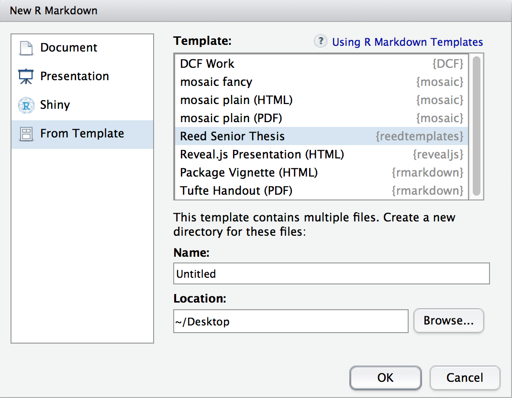

### Overview

The **reed_templates* package (formerly named **rticles** but changed due to ambiguity with the package at `rstudio/rticles`) includes a set of [R Markdown](http://rmarkdown.rstudio.com) templates that enable authoring of journal and conference submissions, e-books, class projects, and a variety of other reports.  Currently, this package only includes a template for creating a senior thesis at Reed College. 

Under the hood, LaTeX templates are used to ensure that documents conform precisely to submission standards. At the same time, composition and formatting can be done using lightweight [markdown](http://rmarkdown.rstudio.com/authoring_basics.html) syntax, and **R** code and its output can be seamlessly included using [knitr](http://yihui.name/knitr/).

Using **reed_templates** has some prerequisites which are described below. To compile PDF documents using **R**, you are going to need to have LaTeX installed.  It can be downloaded for Windows at <http://http://miktex.org/download> and for Mac at <http://tug.org/mactex/mactex-download.html>.  Follow the instructions to install the necessary packages after downloading the (somewhat large) installer files.  You may need to install a few extra LaTeX packages on your first attempt to knit as well.

### Using reed_templates from Chester's GitHub

To use **reed_templates** from RStudio:

1) Install the latest [RStudio](http://www.rstudio.com/products/rstudio/download/).

2) Install the **reed_templates** package: 

```S
install.packages("devtools")
devtools::install_github("ismayc/rticles")
```

3) Use the **New R Markdown** dialog to create an article from one of the templates:


    
    
### Using reed_templates outside of RStudio

1) Install [pandoc](http://johnmacfarlane.net/pandoc/) using the [instructions for your platform](https://github.com/rstudio/rmarkdown/blob/master/PANDOC.md).

2) Install the **rmarkdown** and **reed_templates** packages:

```S
devtools::install_github(c("rstudio/rmarkdown", "ismayc/rticles"))
```
    
3) Use the `rmarkdown::draft` function to create articles:

```S
rmarkdown::draft("MyAbstract.Rmd", template = "reed_thesis", package = "reed_templates")
```

